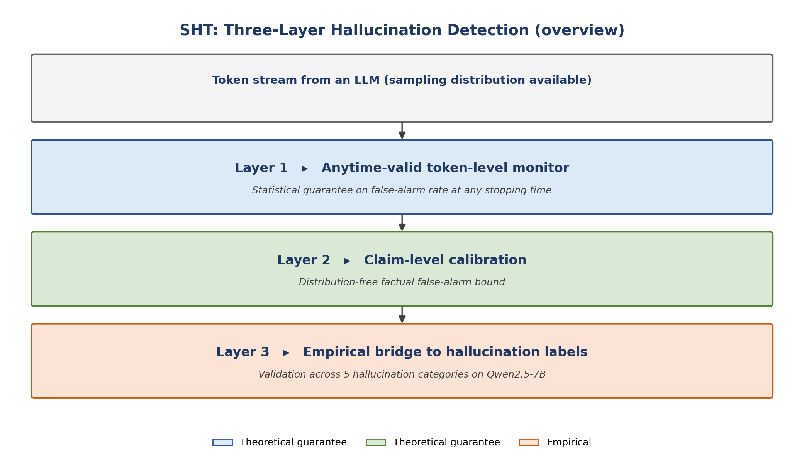

# SHT — Sequential Hypothesis Testing for LLM Hallucination Detection

> 📄 **Public preview.** This repository accompanies a paper currently under preparation for NeurIPS 2026. The full implementation, theoretical proofs, and experimental results will be released upon paper acceptance.
>
> If you are a recruiter, hiring manager, or researcher who would like deeper access (full code, proofs, experimental data) **prior** to public release, please reach out — see [Contact](#contact).

[](#status)
[-b31b1b.svg)](#)
[](#)

---

## 🔍 What this project is

Existing LLM hallucination detectors are largely **batch-mode** — they require completing a generation, sampling multiple alternatives, or running post-hoc retrieval before a decision is made. **SHT** is a sequential, *anytime-valid* framework: it issues a decision as early as sample-efficient evidence allows, with rigorous statistical false-alarm guarantees that hold **at any stopping time**.

The framework cleanly separates three layers of guarantees, each with its own assumption set and its own evaluation methodology — a structural choice that, to the authors' knowledge, has not been made explicit in prior LLM hallucination work.

<p align="center">
  
</p>

| Layer | Role | Guarantee type |
|---|---|---|
| Layer 1 — Token | Anytime-valid monitor on the realised sampling distribution | Provable (martingale-based) |
| Layer 2 — Claim | Distribution-free calibration of claim-level false-alarm rate | Provable (conformal) |
| Layer 3 — Empirical | Bridging the token-level signal to claim-level hallucination labels | Empirical |

This separation matters because it lets us be **honest about what is, and isn't, mathematically proven**. Existing methods often conflate "alarm fires" with "hallucination detected"; we make the gap explicit and quantify it.

## 🎯 Why anytime-valid matters

Most LLM hallucination work uses tests that are valid **only at a pre-specified sample size** — running them at multiple time points without correction inflates Type-I error. SHT instead uses [e-processes](https://arxiv.org/abs/2410.23614) and [test martingales](https://www.sciencedirect.com/science/article/pii/S0167715211002148), which permit **continuous monitoring**: the analyst can peek at the test statistic after every token without sacrificing the false-alarm guarantee. This matches the autoregressive nature of LLM generation in a way that batch-mode methods cannot.

## 🛠️ Technical stack

- **Theoretical machinery:** e-processes, test martingales, Ville's inequality, split conformal prediction, proper scoring rules, Bregman divergences, online Newton-step betting
- **Implementation:** PyTorch · HuggingFace Transformers · NumPy · PyArrow/Parquet · matplotlib
- **Target model:** Qwen2.5-7B-Instruct (with a deterministic custom decoding loop)
- **Comparison baselines:** SelfCheckGPT, Semantic Entropy, FActScore, HARP

## 📊 Status

| Component | Status |
|---|---|
| Layer 1 framework & theory | ✅ Complete |
| Layer 2 framework & theory | ✅ Complete |
| Token-level generation pipeline (Qwen2.5-7B) | ✅ Complete |
| Multi-LLM claim annotation (890 atomic claims) | ✅ Complete |
| Layer 1 finite-sample sanity verification | ✅ Passed |
| Main comparison vs. baselines | 🚧 Running |
| Channel U / Channel O stratification analysis | 🚧 Running |
| Ablation studies | 📋 Planned |
| Paper draft | 🚧 In revision (v8) |

The paper is currently in revision (version 8). NeurIPS 2026 submission targeted for May 2026.

## 🔒 Why this repo is a preview

The paper is under preparation and subject to NeurIPS's double-blind review policy. Releasing the full implementation now would (i) compromise the anonymous-review requirement, and (ii) risk scooping before publication. This is standard practice in the ML research community — see, e.g., the NeurIPS 2024 review policy on code release.

**What's in this preview:**
- High-level architectural overview
- Statement of the problem and approach
- List of theoretical tools used
- Empirical status snapshot

**What's in the full (private) repo:**
- Complete source code for all three layers
- Formal proofs (theorems, lemmas)
- Frozen experiment configurations
- Annotated claim corpus and trajectory data
- Sanity-check and ablation results

## 🚦 Roadmap to public release

```
Now (2026-05) ──┐
                ├── Paper submission to NeurIPS (May–June 2026)
                │     ↳ Anonymised code via anonymous.4open.science
                │
                ├── Review period (June–September 2026)
                │     ↳ Repo remains preview
                │
                ├── Decision (October 2026)
                │     ↳ If accepted: full code + arXiv + camera-ready
                │     ↳ If rejected: revise, retarget, repeat
                │
                └── Public release (planned: Q4 2026)
```

## 📧 Contact

**Jie Yuan** (袁捷)
Wenzhou-Kean University · Department of Mathematical Sciences
📩 [yuanjie@kean.edu](mailto:yuanjie@kean.edu)

If you would like access to the private full repository for **collaboration, recruiting, or referee review** purposes, please email with a brief note about your role and intended use. I'm happy to add collaborators or share private read-only access.

---

<sub>*This README intentionally omits technical details (specific score functions, theorem statements, numerical results) that constitute the contribution of the under-review paper. They will be released here in full once the paper is public.*</sub>
